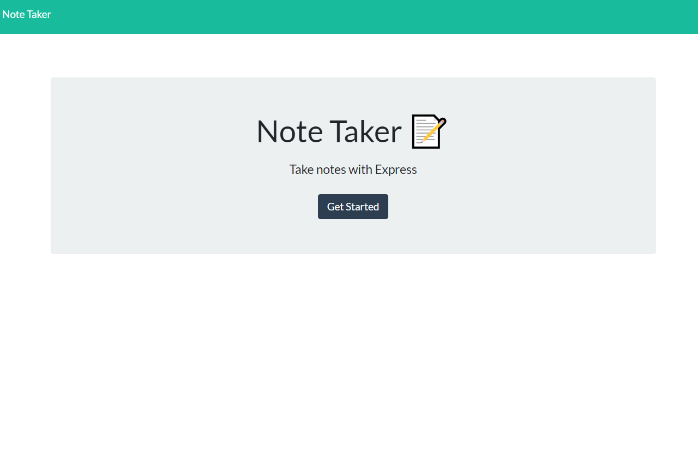
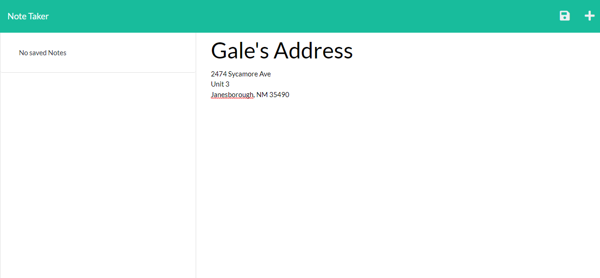
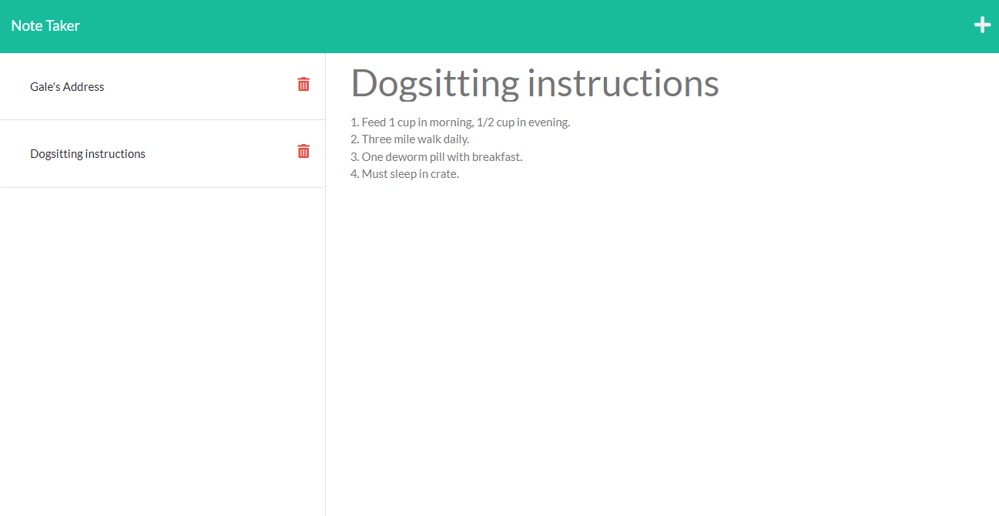

# Note-Master
  

  
## Description

This is a simple note taking app, created while learning express. The application was built in node.

## Table of Contents

- [Installation](#installation)
- [Usage](#usage)
- [Credits](#credits)
- [Features](#features)
- [Contribute](#contribute)
- [Tests](#tests)
- [Questions](#questions)
- [License](#license)

## Installation

1. Clone directory.
2. In Command Line enter "npm init. 
3. In Command Line, enter npm start.

## Usage

This could be used to save little notes and has the same basic functionality as the iOS's notes app.

        

        

        

## Credits

Collaborators
- N/A

Third Party Assets
- Express, UUID.

Tutorials
- N/A

## Features

- Can add notes, delete notes. Notes are saved on the server side for access from any devices.

## How to Contribute

N/A
  
## Tests

N/A

## Questions

Any questions? Contact me at:
- E-mail: joechristiansonwebdev@gmail.com
- GitHub: github.com/JoeChristianson
- Other means: N/A

## License

This app is covered by the MIT license. For more information, visit https://opensource.org/licenses/Apache-2.0.

